# Vitawind 開發環境

## 安裝 node (只要在不會重製的電腦上執行一次即可)

在 node js 的網頁 (https://nodejs.org/en/) 選擇 LTS 的下載

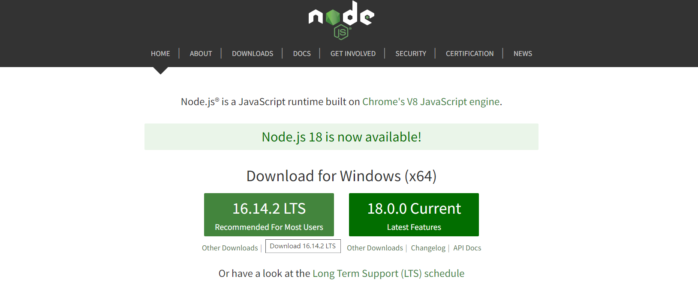

## 設置

打開 cmd

先讓他切到桌面 cd Desktop

接著打上 npm i -g create-vitawind

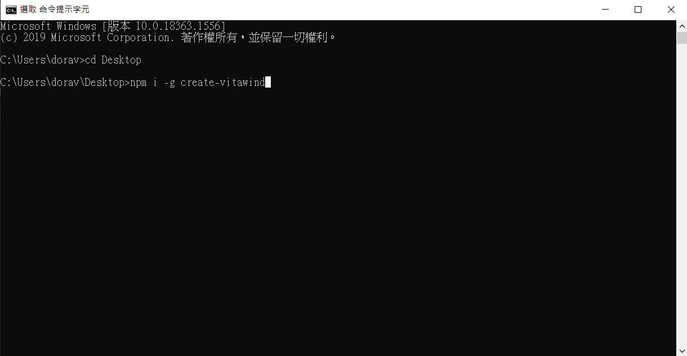

安裝完後

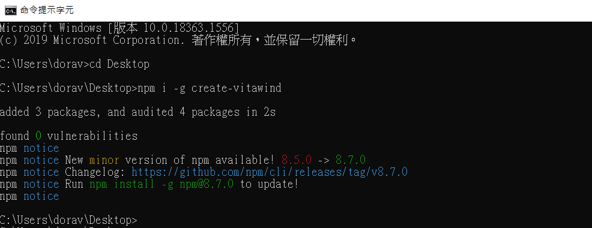

## 專案下載

進入 Vitawind (https://vitawind.vercel.app/zh/) 並點選馬上開始

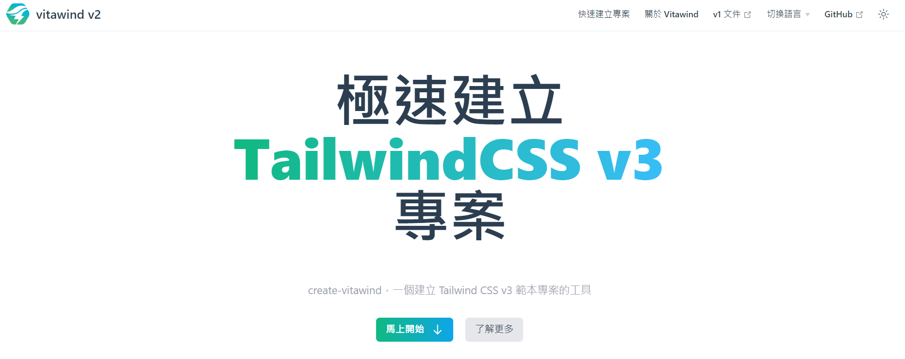

打入專案名稱

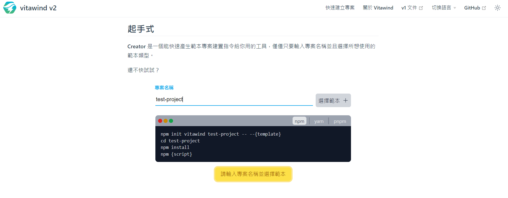

選擇範本 Vanilla JS

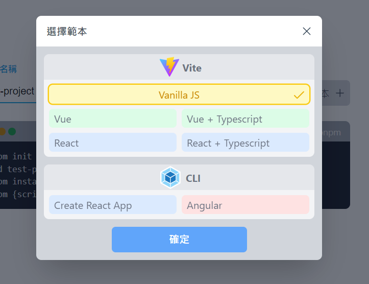

按下一件複製,並在 cmd 上貼上

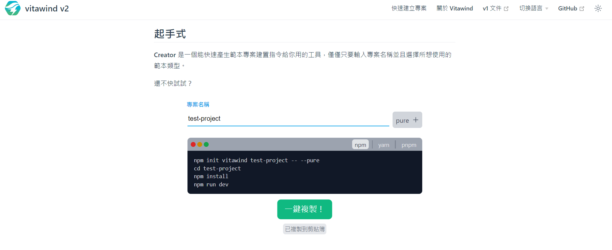

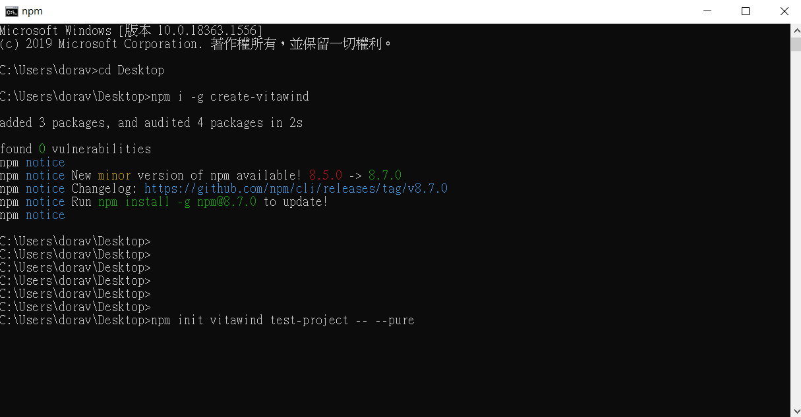

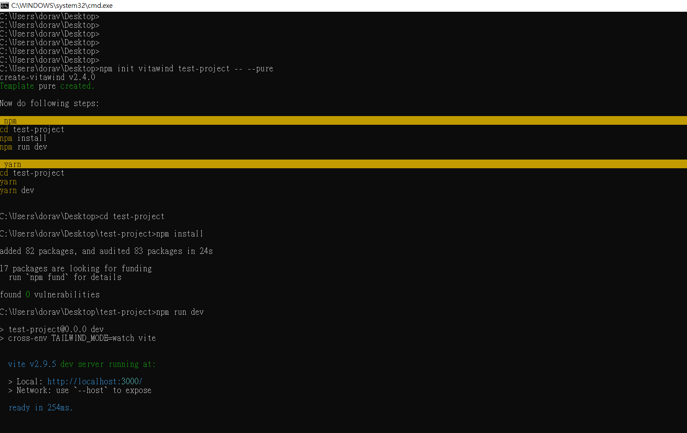

以上動作完成就會在桌面上看到一個資料夾

## 用 Visual Studio Code 把這個資料夾打開

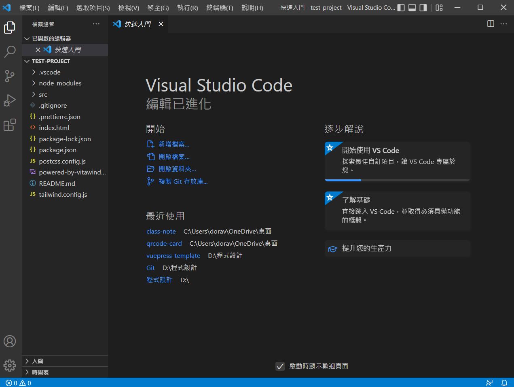

### 刪除部分內容

將 src 資料夾裡的 index.css 的 5 到 7 行刪除

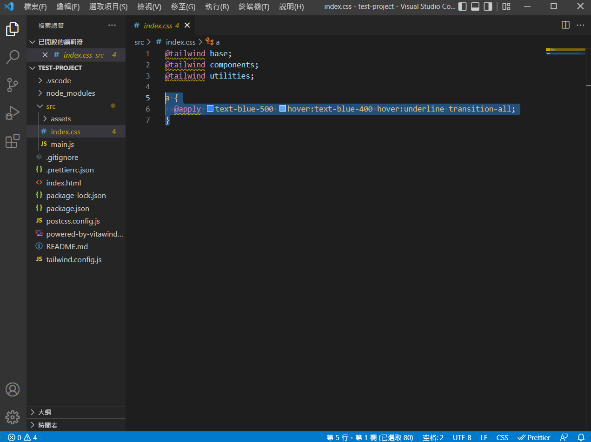

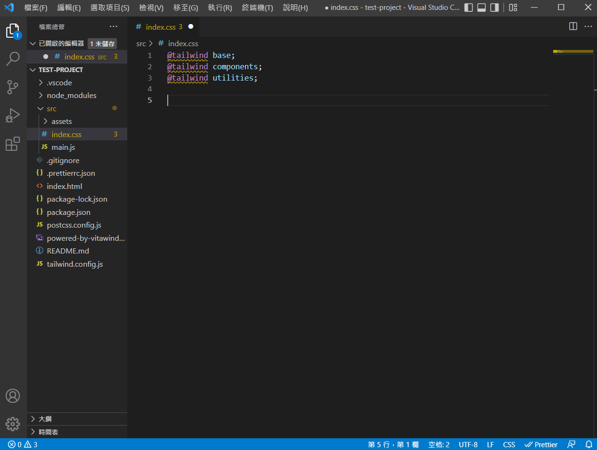

將 index.html 的 10 到 28 行刪除

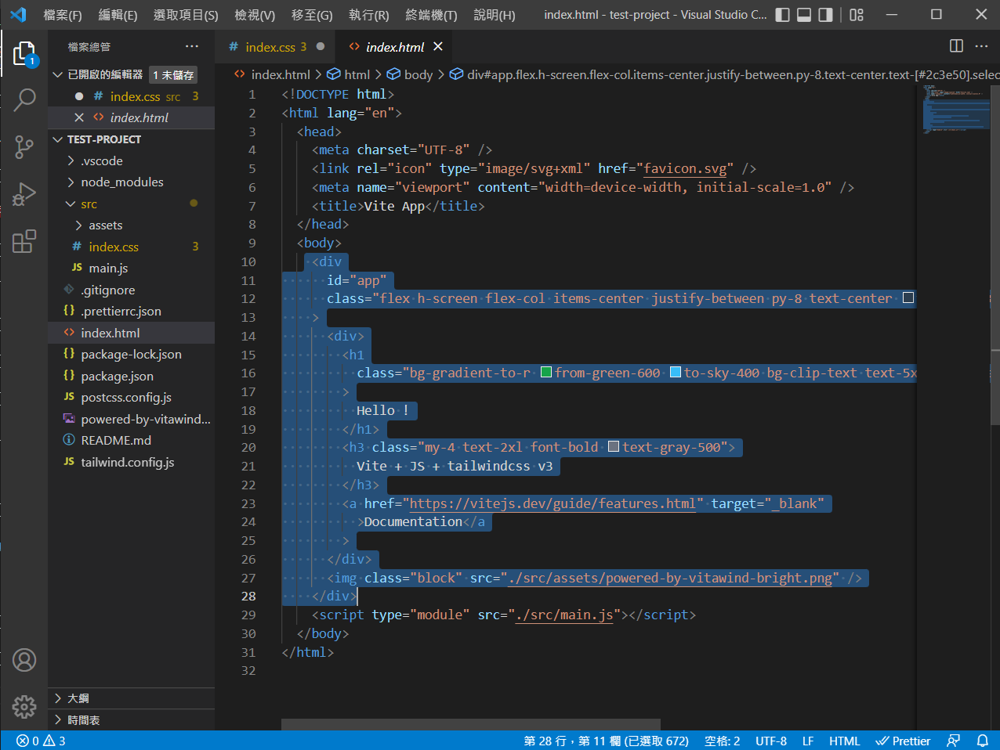

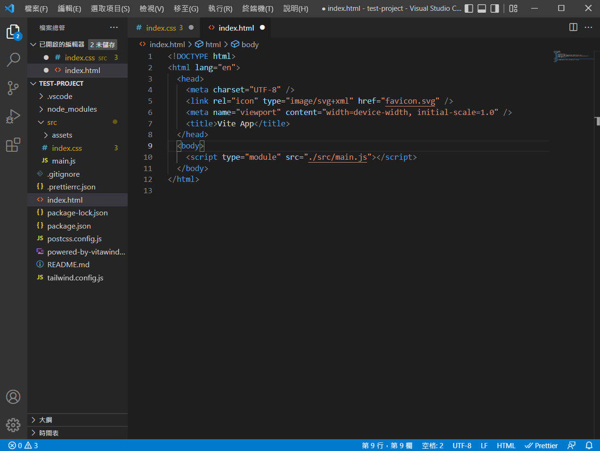

#### 接著記得儲存 ctrl+s

